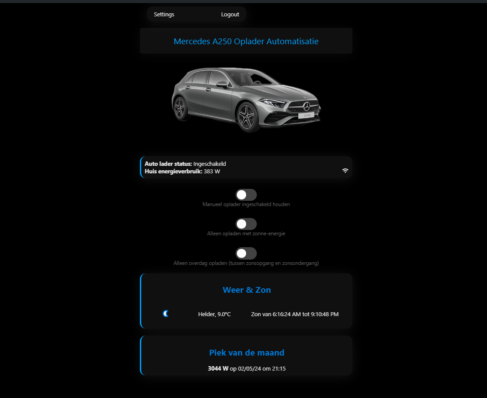

# Mercedes A250 Charger Automation

This project offers an innovative solution for automating the charging process of the Mercedes A250 electric vehicle. By monitoring live power usage and solar production through the HomeWizzard API, the application ensures the household's peak power consumption remains below a user-defined threshold. This not only optimizes energy efficiency but also maximizes the benefits of solar power, all while maintaining the convenience of web-based control and monitoring.

## Features

- **Real-Time Energy Monitoring**: Leveraging the HomeWizzard API, the application provides a live view of the entire home's power usage.
- **Intelligent Charging**: Automatically manages the charging of your Mercedes A250 to occur at optimal times, reducing peak energy consumption without compromising on user needs.
- **User-Configurable Settings**: Allows users to define the maximum peak power usage, adapting the system's behavior to varying energy needs and conditions.
- **Weather and Sunlight Data Integration**: Displays current weather conditions and sunlight data, informing users and the system for better energy management decisions.
- **Web Interface**: A user-friendly dashboard for real-time monitoring, scheduling charger activation, and adjusting settings to user preferences.
- **Notifications**: Receive an email when the charger status is changed.
- **Darkmode**: Automatic system darkmode.
- **Solar charging**: Only charge on solar energy.

## Getting Started

Follow these instructions to get the project up and running on your local machine for development and testing purposes.

### Prerequisites

- Python 3.7 or higher
- Flask
- Requests

### Installation

1. Clone the repository:
   ```sh
   git clone https://github.com/EwoutDeCoster/charger-automation
   ```
2. Install the necessary Python packages:
   ```sh
   pip install -r requirements.txt
   ```

### Configuration 
To configure the system, edit the `config.json` file to include your maximum peak power usage, auto-charge power consumption, and notification settings. Ensure you have the HomeWizzard API enabled to enable live monitoring of your home's energy consumption and solar production.

### Usage
The web interface is accessible locally and provides detailed insights into your home's energy dynamics and the charging status of your Mercedes A250. Here's how you can use the system effectively:

- Dashboard: Access real-time data on energy usage, solar production, and car charging status.
- Settings: Adjust your energy and charging preferences as your needs or conditions change.

### Screenshots
#### Homepage

#### Config
